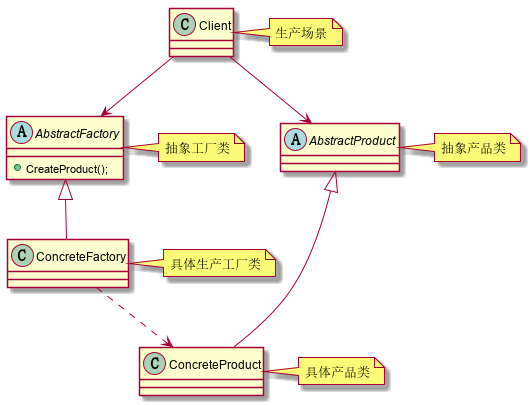
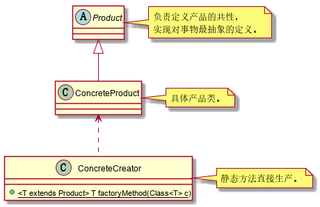
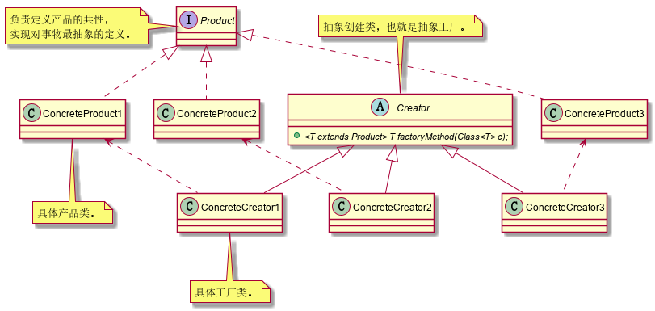
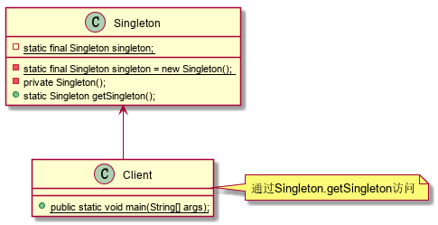
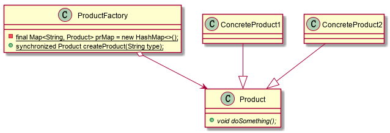

# 二十三种设计模式.创建型模式.抽象工厂模式

Provide an interface for creating families of related or dependent objects without specifying their concrete classes.
（为创建一组相关或相互依赖的对象提供一个接口，而且无须指定它们 的具体类。）

#### 类图

#### 抽象工厂模式的优点：

1. 良好的封装性，代码结构清晰；

2. 工厂方法模式的扩展性非常优秀；

3. 屏蔽产品类。

#### 抽象工厂模式的应用场景：

1. 工厂方法模式是new一个对象的替代品，所以所有需要产生对象的地方都可以使用，但要考虑使用后是否只是徒增复杂度；

2. 需要灵活的、可扩展的框架时，可以考虑采用工厂方法模式；

3. 工厂方法模式可以用在异构项目中；

4. 可以使用在测试驱动开发的框架下（此点已经被JMock和EasyMock取代，不用了）。

#### 二十三种设计模式.创建型模式.抽象工厂模式

- 放弃扩展性，缩小为简单工厂模式（也叫静态工厂模式），在只需要一个工厂的时候可以使用；

- 针对每种不同的具体产品，设计专用的生产工厂，即升级为多工厂模式；

- 替代单例模式；

- 延迟初始化。

