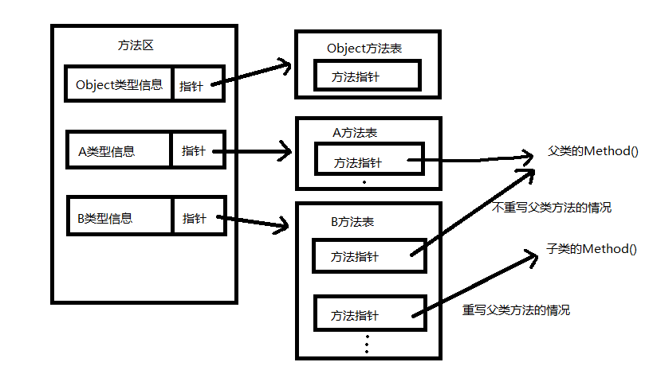

# 面向对象的三大特性--继承、封装和多态

## 多态

本质上多态分两种：

1. 编译时多态（静态多态，比如重载）：编译时就已经确定。
2. 运行时多态（动态多态，实现方法有继承父类、实现接口）：方法到运行时才能确定使用哪个，也叫延迟方法。

不管一个对象用父类还是接口声明，再用子类实例化，最终目的都只是希望使用到父类或接口规定的功能而已，这种写法不获取继承这个父类或实现这个接口的子类的其他方法和字段，可以有效节省空间。

### 重写与重载的区别

#### 重写（覆盖）

1. 参数列表、返回值完全相同；
2. 访问修饰符一定大于等于被重写的访问修饰符（public > protected > default > private）；
3. 抛出的异常一致，或者是原异常的子类；
4. 被重写的方法不能为private，否则在其子类中只是新定义了一个方法，并没有对其进行重写；
5. 静态方法不能重写为非静态方法（会编译出错）。

注：仅仅返回值不同的重写会编译出错。

#### 重载

1. 使用相同方法名，但是参数列表（包括参数类型、参数个数、参数顺序等）一定不同；
2. 不能通过访问权限、返回类型、抛出的异常进行重载；

### 下面从JVM层面介绍一下多态的继承实现

假设A是B的父类，程序运行的时候，类型信息先是会被加载到方法区中，
类型信息中有一个指向该类方法表的指针，方法表记录着类方法的指针，
如果B重写了A的方法，那么B中方法表的指针则是指向B对应的方法，而不是父类原本的方法。

多态的机制在此时就清晰了，在调用方法时，虚拟机先将符号引用解析为直接引用，然后调用这个方法。

这个直接引用是怎么来的呢？虚拟机先通过对象引用找到类型信息，找到方法表入口，当将子类声明为父类时，形式上调用的是父类的方法，此时虚拟机会从实际
类的方法表（虽然声明的是父类，但是实际上这里的类型信息中存放的是子类的信息）查找该方法名对应的指针，进而找到指向实际类的方法

A a = new A();//声明是静态类型（编译即确定），new是动态类型（运行才确定）

A b = new B()